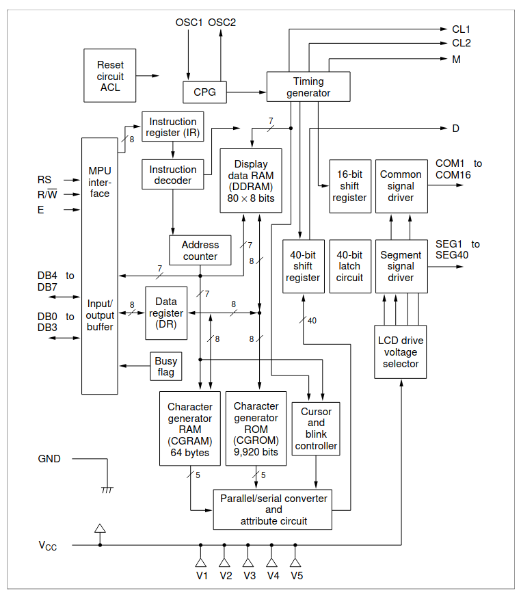
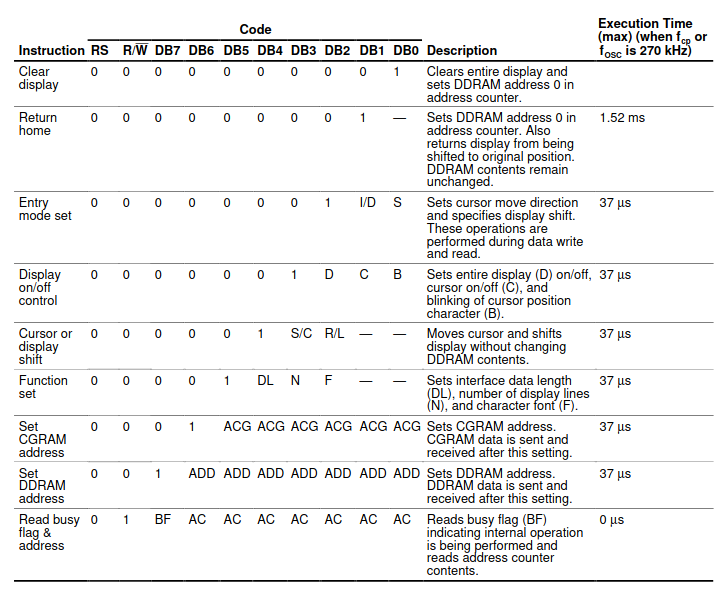
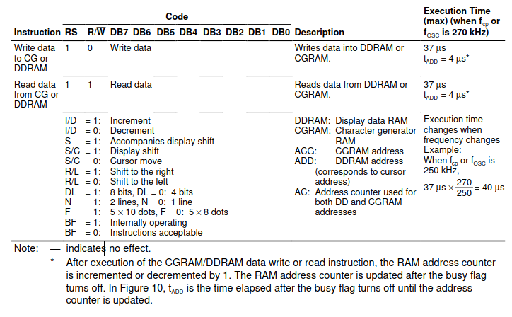
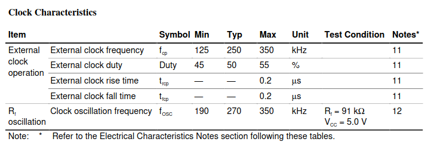
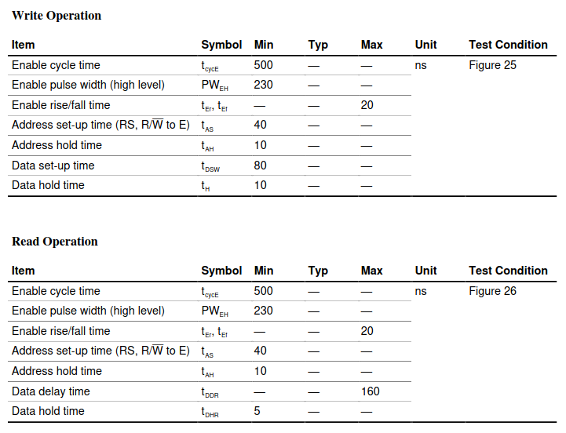
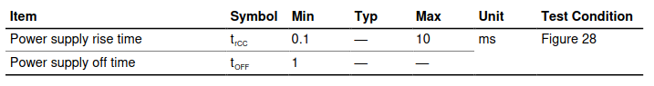
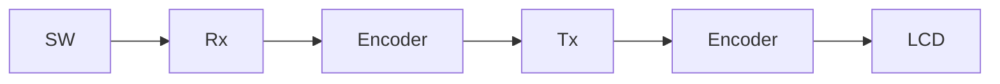
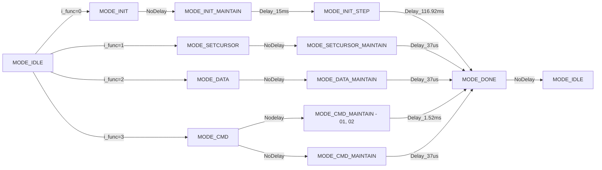

# HD 44780U - HATACHI ([Datasheet](https://cdn.sparkfun.com/assets/9/5/f/7/b/HD44780.pdf "thislink"))

```makefile
# # Configuration
# TOPMODULE := IP_LCD_timer_counter
# CPP_TESTBENCH := tb_IP_LCD_timer_counter.cpp
# VERILATOR_FLAGS := --cc --exe --build --timing --trace
# WARNING_IGNORE := -Wno-fatal -Wno-lint -Wno-style -Wno-width
# VERILOG_SOURCES := ../../02_rtl/IP_LCD_timer_counter.sv

# # Targets
# all: clean compile run

# compile:
# 	@echo "-> Compiling design with Verilator..."
# 	@verilator $(VERILATOR_FLAGS) $(WARNING_IGNORE) \
# 		--top-module $(TOPMODULE) \
# 		$(VERILOG_SOURCES) \
# 		$(CPP_TESTBENCH)

# run:
# 	@echo "-> Running simulation..."
# 	@./obj_dir/V$(TOPMODULE) | tee simulation.log
# 	@echo "Simulation completed. Log saved to simulation.log"

# sim:
# 	@echo "-> Opening waveform viewer..."
# 	@gtkwave waveform.vcd &> /dev/null &

# clean:
# 	@echo "-> Cleaning project..."
# 	@rm -rf obj_dir *.dmp *.vcd simulation.log

# help:
# 	@echo "Makefile targets:"
# 	@echo "  all      : Clean, compile and run (default)"
# 	@echo "  compile  : Compile the design with Verilator"
# 	@echo "  run      : Run the simulation"
# 	@echo "  sim      : Open waveform viewer"
# 	@echo "  clean    : Remove generated files"
# 	@echo "  help     : Show this help message"

# .PHONY: all compile run sim clean help
# Configuration                                
```

## Block Diagram



## Function Description

+ **Register**: IR(instruction register), DR(data register).
+ **Busy Flag(BF)**: When RS = 0, RW = 1, the busy flag output to DB7.
+ **Address Counter(AC)**: Assign address to both DDRAM or CGRAM.
+ **Display data RAM(DDRAM)**: extended capacity is 80x8 bits, or 80 characters.
+ **Chacracter genertor ROM(CGROM)**: Bộ tạo ký tự ROM tạo ra các mẫu ký tự 5 × 8 chấm hoặc 5 × 10 chấm từ mã ký tự 8 bit. Nó có thể tạo ra 208 mẫu ký tự 5 × 8 chấm và 32 mẫu ký tự 5 × 10 chấm. Các mẫu ký tự do người dùng xác định cũng có sẵn bằng ROM được lập trình bằng mặt nạ.
+ **Character Generator RAM(CGRAM)**: Trong RAM bộ tạo ký tự, người dùng có thể viết lại các mẫu ký tự theo chương trình. Đối với 5 × 8 chấm, có thể viết tám mẫu ký tự và đối với 5 × 10 chấm, có thể viết bốn mẫu ký tự.

## Intruction Description

<!-- + I/D = 1: Increment
+ I/D = 0: Decrement
+ S = 1: Accompanies display shift
+ S/C = 1: Display shift
+ S/C = 0: Cursor move
+ R/L = 1: Shift to the right
+ R/L = 0: Shift to the left
+ DL = 1: 8 bits, DL = 0: 4 bits
+ N = 1: 2 lines, N = 0: 1 line
+ F = 1: 5 × 10 dots, F = 0: 5 × 8 dots
+ BF = 1: Internally operating 
+ BF = 0: Instructions acceptable -->





## AC Characteristics

Vcc = 4.5, to 5.5V, Ta = -30 to +75 độ C



| **Thông số**                               | **Ý nghĩa**                                                                                                                | **Giá trị** |
| -------------------------------------------------- | ---------------------------------------------------------------------------------------------------------------------------------- | ------------------- |
| **External Clock Frequency (fCP)**           | Tần số của tín hiệu đồng hồ bên ngoài cung cấp qua chân OSC2 (khi sử dụng chế độ external clock).                 | >125 and <350 kHz   |
| **External Clock Duty**                      | Tỷ lệ phần trăm thời gian tín hiệu đồng hồ bên ngoài ở mức cao (high level) trong một chu kỳ.                      |                     |
| **External Clock Rise Time (trCP)**          | Thời gian tăng (từ mức thấp lên mức cao) của tín hiệu đồng hồ bên ngoài trên chân OSC2.                           | <200 ns             |
| **External Clock Fall Time (tfCP)**          | Thời gian giảm (từ mức cao xuống mức thấp) của tín hiệu đồng hồ bên ngoài trên chân OSC2.                         | <200 ns             |
| **Clock Osc16 Oscillation Frequency (fOSC)** | Tần số dao động của mạch dao động bên trong, sử dụng khi kết nối tụ và điện trở ngoài vào chân OSC1 và OSC2. | 190 kHz - 350 kHz   |

### Giải thích chi tiết

1. **External Clock Frequency (fCP)**:

   - **Ý nghĩa**: Xác định tần số của tín hiệu đồng hồ bên ngoài cung cấp cho HD44780U qua chân OSC2 khi sử dụng chế độ đồng hồ bên ngoài (external clock mode). Tín hiệu này điều khiển hoạt động của LCD, bao gồm việc làm mới hiển thị và giao tiếp với driver bên ngoài (nếu có).
   - **Giá trị**: Từ 125 kHz đến 250 kHz.
   - **Ứng dụng**: Tần số này ảnh hưởng đến tốc độ làm mới LCD. Tần số cao hơn (gần 250 kHz) giúp giảm nhấp nháy (flicker) trên màn hình, nhưng phải nằm trong phạm vi cho phép để đảm bảo hoạt động ổn định.
   - **Lưu ý**: Chân OSC1 được để trôi (floating) trong chế độ này, và tín hiệu đồng hồ được cung cấp trực tiếp vào OSC2.
2. **External Clock Duty**:

   - **Ý nghĩa**: Tỷ lệ giữa thời gian mức cao (high level) và toàn bộ chu kỳ của tín hiệu đồng hồ bên ngoài, biểu thị dưới dạng phần trăm.
   - **Giá trị**: 50% ± 5% (tức là từ 45% đến 55%).
   - **Ứng dụng**: Duty cycle gần 50% đảm bảo thời gian mức cao và mức thấp cân bằng, giúp đồng bộ hóa chính xác giữa HD44780U và các thành phần khác (như driver bên ngoài). Sai lệch quá lớn (>5%) có thể gây lỗi thời gian.
   - **Lưu ý**: Duty cycle không đối xứng (ví dụ: 40% hoặc 60%) có thể làm giảm độ tin cậy của giao tiếp.
3. **External Clock Rise Time (trCP)**:

   - **Ý nghĩa**: Thời gian cần thiết để tín hiệu đồng hồ bên ngoài chuyển từ mức thấp (0V) lên mức cao (VDD) trên chân OSC2.
   - **Giá trị**: Tối đa 50 ns.
   - **Ứng dụng**: Thời gian tăng nhanh (dưới 50 ns) đảm bảo cạnh lên của tín hiệu đồng hồ sắc nét, giảm nguy cơ nhiễu hoặc sai lệch thời gian khi đồng bộ hóa.
   - **Lưu ý**: Nếu thời gian tăng quá dài (do trở kháng hoặc tụ ký sinh), có thể gây lỗi đồng bộ.
4. **External Clock Fall Time (tfCP)**:

   - **Ý nghĩa**: Thời gian cần thiết để tín hiệu đồng hồ bên ngoài chuyển từ mức cao (VDD) xuống mức thấp (0V) trên chân OSC2.
   - **Giá trị**: Tối đa 50 ns.
   - **Ứng dụng**: Tương tự rise time, fall time ngắn giúp đảm bảo cạnh xuống của tín hiệu đồng hồ rõ ràng, hỗ trợ đồng bộ hóa chính xác.
   - **Lưu ý**: Cần đảm bảo nguồn đồng hồ có trở kháng thấp để đạt được thời gian giảm trong giới hạn.
5. **Clock Oscillation Frequency (fOSC)**:

   - **Ý nghĩa**: Tần số dao Perspective của mạch dao động bên trong, được tạo ra bởi mạch RC (tụ và điện trở) kết nối với chân OSC1 và OSC2.
   - **Giá trị**: Từ 190 kHz đến 250 kHz.
   - **Ứng dụng**: Trong chế độ dao động bên trong (internal oscillator mode), HD44780U sử dụng mạch RC ngoài để tạo tín hiệu đồng hồ, điều khiển hoạt động của LCD mà không cần nguồn đồng hồ bên ngoài.

## Bus Timming Characteristics



Các giá trị áp dụng cho điện áp VDD từ 4.5V đến 5.5V và nhiệt độ hoạt động từ -30°C đến +75°C.

| **Thông số**                             | **Ý nghĩa**                                                                                              | **Giá trị** |
| ------------------------------------------------ | ---------------------------------------------------------------------------------------------------------------- | ------------------- |
| **Enable Cycle Time (TC)**                 | Thời gian tối thiểu của một chu kỳ tín hiệu Enable (E) từ rising edge đến rising edge tiếp theo.     | >500 ns             |
| **Enable Pulse Width (High Level, PWEH)**  | Độ rộng xung mức cao của tín hiệu Enable (E).                                                             | >230 ns             |
| **Enable Rise/Fall Time (tEr, tEf)**       | Thời gian tăng (rise) hoặc giảm (fall) của tín hiệu Enable (E).                                           | <20 ns              |
| **Address Setup Time (RS, R/W to E, tAS)** | Thời gian tối thiểu mà RS và R/W cần ổn định trước khi E tăng (rising edge).                         | >40 ns              |
| **Address Hold Time (tAH)**                | Thời gian tối thiểu mà RS và R/W cần giữ ổn định sau khi E giảm (falling edge).                       | >10 ns              |
| **Data Setup Time (tDSW)**                 | Thời gian tối thiểu mà dữ liệu (D0-D7) cần ổn định trước khi E giảm (falling edge, chế độ ghi).  | >80 ns              |
| **Data Hold Time (tH)**                    | Thời gian tối thiểu mà dữ liệu (D0-D7) cần giữ ổn định sau khi E giảm (falling edge, chế độ ghi). | >10 ns              |

### Chi tiết bổ sung

- **Chế độ đọc (Read Mode)**:
  - **Data Output Delay Time (tDDR)**: Tối đa 360 ns (thời gian từ khi E tăng đến khi dữ liệu xuất ra ổn định).
  - **Data Hold Time (tDH, chế độ đọc)**: Tối thiểu 5 ns (thời gian dữ liệu cần giữ sau khi E giảm).
- **Nguồn tham khảo**: Hitachi HD44780U datasheet, mã ADE-207-272(Z), '99.9, Rev. 0.0, Table 7 (Timing Characteristics), trang 55-56.
- **Chế độ hoạt động**: Các thông số áp dụng cho cả giao tiếp 4-bit và 8-bit. Ở chế độ 4-bit, mỗi byte dữ liệu cần hai chu kỳ Enable (truyền từng nibble).
- **Busy Flag**: Để tối ưu hóa, nên kiểm tra cờ bận (Busy Flag) thay vì sử dụng độ trễ cố định, đặc biệt với các lệnh như Clear Display (tối đa 1.53 ms).

## Interface Timing Characteristics with External Driver


Các giá trị áp dụng cho điện áp VDD từ 4.5V đến 5.5V, nhiệt độ hoạt động từ -30°C đến +75°C, và được sử dụng khi HD44780U giao tiếp với driver bên ngoài (như HD44100H).

| **Thông số**                           | **Ý nghĩa**                                                                                                      | **Giá trị** |
| ---------------------------------------------- | ------------------------------------------------------------------------------------------------------------------------ | ------------------- |
| **Clock Pulse Width (High Level, tCWH)** | Độ rộng xung mức cao của tín hiệu đồng hồ (CL1).                                                               | >800 ns             |
| **Clock Pulse Width (Low Level, tCWL)**  | Độ rộng xung mức thấp của tín hiệu đồng hồ (CL1).                                                             | >800 ns             |
| **Clock Setup Time (tCSU)**              | Thời gian thiết lập tối thiểu giữa tín hiệu đồng hồ CL2 và CL1 trước khi CL1 chuyển trạng thái.         | >500 ns             |
| **Data Setup Time (tDSU)**               | Thời gian tối thiểu mà dữ liệu (DB0-DB7) cần ổn định trước khi CL1 giảm (falling edge).                     | >300 ns             |
| **Data Hold Time (tDH)**                 | Thời gian tối thiểu mà dữ liệu (DB0-DB7) cần giữ ổn định sau khi CL1 giảm (falling edge).                    | >300 ns             |
| **M Delay Time (tDM)**                   | Độ trễ giữa tín hiệu M và tín hiệu đồng hồ CL1 (từ falling edge của CL1 đến khi M chuyển trạng thái). | -100 ns - +100 ns   |
| **Clock Rise/Fall Time (tCr, tCf)**      | Thời gian tăng (rise) hoặc giảm (fall) của tín hiệu đồng hồ (CL1, CL2).                                        | <50 ns              |

### Chi tiết bổ sung

- **Tín hiệu liên quan**:
  - **CL1**: Tín hiệu đồng hồ chính để đồng bộ hóa dữ liệu với driver bên ngoài.
  - **CL2**: Tín hiệu đồng hồ phụ, thường dùng để điều khiển hiển thị (shift data).
  - **M**: Tín hiệu điều khiển chế độ (mode), ví dụ: chuyển đổi giữa các trạng thái hiển thị.
  - **DB0-DB7**: Bus dữ liệu truyền đến driver bên ngoài.

## Power Supply Conditions Using Internal Reset Circuit



| **Thông số**                   | **Ý nghĩa**                                                                                                         | **Giá trị** |
| -------------------------------------- | --------------------------------------------------------------------------------------------------------------------------- | ------------------- |
| **Power Supply Rise Time (tr)**  | Thời gian tăng của điện áp nguồn VDD từ 0V đến mức hoạt động tối thiểu (4.5V).                              | 0.1 ms đến 10 ms  |
| **Power Supply Off Time (tOFF)** | Thời gian tối thiểu mà nguồn VDD phải ở mức thấp (dưới 0.7V) trước khi bật lại để đảm bảo reset đúng. | Tối thiểu 1 ms    |

### Chi tiết bổ sung

- **Điều kiện hoạt động**:
  - **Power Supply Rise Time (tr)**: Thời gian tăng từ 0V đến 4.5V phải nằm trong khoảng 0.1 ms đến 10 ms để tránh lỗi reset. Quá nhanh (<0.1 ms) hoặc quá chậm (>10 ms) có thể khiến reset không hoạt động đúng.
  - **Power Supply Off Time (tOFF)**: Nguồn phải ở mức dưới 0.7V ít nhất 1 ms trước khi bật lại để đảm bảo trạng thái reset được thiết lập lại hoàn toàn.
- **Điện áp hoạt động**:
  - VDD tối thiểu để kích hoạt reset: 4.5V.
  - Trong quá trình reset, VDD phải duy trì ổn định trên 4.5V để hoàn tất quá trình khởi tạo nội bộ.

# Block Control LCD

## Spec

| Port       | Size | Func                                                     |
| :--------- | :--: | :------------------------------------------------------- |
| i_clk      |  1  | Tín hiệu Clock của bộ điều khiển đi vào LCD     |
| i_rst_n    |  1  | Tín hiệu reset tích cực thấp                        |
| i_data     |  8  | Dữ liệu đầu vào các Port Data của LCD             |
| i_func_lcd |  8  | Các chức năng của bộ điều khiển LCD              |
| o_LCD_DATA |  8  | Dữ liệu vào Port DB0-DB7                              |
| o_LCD_RW   |  1  | Tín hiệu RW, RW = 0(Write), RW = 1(Read)               |
| o_LCD_EN   |  1  | Tín hiệu Enable, E = 0(Disenable), E = 1(Enable)       |
| o_LCD_RS   |  1  | Tín hiệu RS, RS = 0(Command), RS = 1(Data)             |
| o_LCD_ON   |  1  | Tín hiệu ON, ON = 0(Turn off LCD), ON = 1(Turn on LCD) |
| o_LCD_BLON |  1  | Tín hiệu BLON, BLON = 0(No Blink), BLON = 1(Blink)     |
| o_valid    |  1  | Hoàn thành func hiện tại (o_valid = 1)               |

### i_func_lcd

+ INIT (0): Khởi tạo LCD
+ SET_CURSOR (1) `{[COL][ROW]}`: với set i_data đầu vào với 4bit cao là set COL và 4bit thấp set ROW
+ WRITE_DATA (2): ghi data ra LCD
+ WRITE_CMD (3): ghi command ra LCD

## Block Diagram



## Thời gian khi giao tiếp với HD44780U

| Parameter                |  Min  | Max | Value | Note                                              |
| :----------------------- | :---: | :--: | :----: | :------------------------------------------------ |
| Tpw (Enable Pluse Width) | 230ns |      | >450ns | Giá trị 'EN' giữ ở mức cao                   |
| Tdsw (Data setup time)   | 80ns |      | >195ns | Giữ dữ liệu ổn định trước khi 'EN' xuống |
| Delay sau Power on       | 0.1ms | 10ms |  10ms  | Sau khi bật nguồn                               |
| Clear display delay      |      |      | 1.52ms | Sau lệnh '0x01' (clear display)                  |
| Return home              |      |      | 1.52ms | Sau lệnh '0x02' (return home)                    |
| Lệnh thường           |      |      |  37us  | Lệnh bình thường                              |

## Các lệnh của LCD16x4 HD44780U

| Mã lệnh (HEX) | Chức năng                                           |
| :-------------: | :---------------------------------------------------- |
|     '0x01'     | Xóa màn hình (Clear display)                       |
|     '0x02'     | Đưa con trỏ về ví trí ban đầu '(0, 0)'        |
|     '0x04'     | Entry Mode: giảm địa chỉ, không dịch màn hình |
|     '0x06'     | Entry Mode: Tăng địa chỉ, không dịch màn hình |
|     '0x08'     | Display OFF, Cursor OFF                               |
|     '0x0C'     | Display ON, Cursor OFF                                |
|     '0x0E'     | Display ON, Cursor ON                                 |
|     '0x10'     | Dịch con trỏ trái                                  |
|     '0x14'     | Dịch con trỏ phải                                  |
|     '0x18'     | Dịch toàn màn hình trái                          |
|     '0x1C'     | Dịch toàn màn hình phải                          |
|     '0x28'     | Chế độ 4-bit, 2 dòng, font 5x8                    |
|     '0x38'     | Chế độ 8-bit, 2 dòng, font 5x8                    |
|  '0x80 + addr'  | Đặt vị trí DDRAM (addr: '0x00->0x27')             |

## Các máy trạng thái trong Module IP_LCD_control


